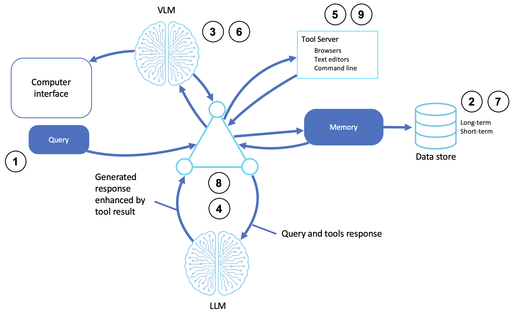

# Computer-Use Agents

Agents that operate software built for humans, i.e., browsers, desktops, and applications, by combining LLM reasoning with visual understanding and simulated input. The agent acts as a proxy that performs actions the way a person would.

This sample is the **hands-on** counterpart to the blog post [Agents That Use Computers: Browsers, Desktops, and the GUI Frontier](Agents%20That%20Use%20Computers%20-%20Browsers%2C%20Desktops%2C%20and%20the%20GUI%20Frontier.md). This sample drives real browsers and desktops with the [Strands Agents SDK](https://strandsagents.com/) and its [community tools](https://strandsagents.com/docs/user-guide/concepts/tools/community-tools-package/), and is based off of the [AWS Prescriptive Guidance - Computer-use agents pattern](https://docs.aws.amazon.com/prescriptive-guidance/latest/agentic-ai-patterns/computer-use-agents.html).

## Table of Contents

- [Quick Start](#quick-start)
- [Local Browser Agent](#local-browser-agent)
  - [How It Works](#how-it-works)
  - [Driving the Browser](#driving-the-browser)
  - [Other Browser Use Cases](#other-browser-use-cases)
- [Managed Browser Agent](#managed-browser-agent)
- [Desktop Agent](#desktop-agent)
- [AWS Implementation Patterns](#aws-implementation-patterns)
- [Reference](#reference)

## Quick Start

**Prerequisites:**
- Python 3.10+
- An AWS account with Amazon Bedrock access
- AWS credentials configured (`aws configure`) with permission to invoke models on Bedrock
- **Local browser agent**: `playwright install chromium` (downloads the browser binary)
- **Desktop agent**: [Tesseract OCR](https://github.com/tesseract-ocr/tesseract) (`brew install tesseract` / `apt-get install tesseract-ocr`) and OS screen-recording permission
- **Managed browser agent**: IAM permissions for `bedrock-agentcore:*Browser*` ([onboarding guide](https://docs.aws.amazon.com/bedrock-agentcore/latest/devguide/browser-onboarding.html))

```bash
# Create and activate virtual environment
python3 -m venv venv
source venv/bin/activate  # On Windows: venv\Scripts\activate

# Install dependencies, then the Chromium binary for Playwright
pip install -r requirements.txt

# Point the sample at your AWS profile and region (loaded by shared/model.py)
cp .env.example .env
# Edit .env: set AWS_PROFILE and AWS_REGION. Optionally pin a model with STRANDS_MODEL_ID.
python -m playwright install chromium

# Local browser (start here — most self-contained)
python playwright_agent.py

# Managed browser in AWS (needs AgentCore Browser IAM permissions)
python agentcore_browser_agent.py

# Full desktop control (needs Tesseract + screen-recording permission)
python desktop_agent.py

# Optional: run any/all use cases from one menu
python test_examples.py
```

> **Note:** This sample necessarily runs outside the usual Bedrock-only pattern. Controlling a browser or desktop requires local software (a browser binary, OCR, OS permissions) or a managed browser. Each agent guards its imports and prints setup help if a dependency is missing.

**Try these exercises:**
1. **Research a page.** Ask the playwright agent to open a site and summarize it, then ask a follow-up so you see the session persist.
2. **Scrape structured data.** Point the scraper agent at `https://books.toscrape.com` and ask for the first five titles and prices as JSON.
3. **Fill a form.** Have the form agent complete the test form.
4. **Compare local vs. managed.** Run the same task using the `playwright agent` and `agentcore browser agent` and note where execution happens.

---

## Local Browser Agent

The [Playwright agent](playwright_agent.py) drives a local Chromium browser through the Strands `LocalChromiumBrowser` tool. The agent navigates, reads the page, clicks, types, and extracts information.

### How It Works

1. **Receives a query**: a task arrives through the UI, an API, or natural language
2. **Accesses memory**: the agent recalls past commands, goals, and system state
3. **Analyzes the visual context**: a visual model observes the screen or UI elements to identify actionable items
4. **Reasons through an LLM**: the LLM combines the query, memory, and tool responses to decide the next action
5. **Interacts with a tool server**: the agent invokes tools — a headless or visible browser, a shell, an editor
6. **Updates visual inputs**: if the UI changes, the agent re-observes the screen or text buffers
7. **Updates memory**: new state and feedback are written back to memory
8. **Formulates decisions**: the LLM synthesizes results or recommends actions
9. **Returns a response**: the agent reports the completed task, confirmation, or generated content




### Driving the Browser

Attach the browser tool and the agent handles navigation and interaction on its own:

```python
from strands import Agent
from strands_tools.browser import LocalChromiumBrowser

browser_tool = LocalChromiumBrowser()
agent = Agent(
    system_prompt="You are a web research assistant with browser access...",
    tools=[browser_tool.browser],
    callback_handler=None,
)

response = agent("Go to https://quotes.toscrape.com and summarize the first two quotes")
```

We wrap this in a small `BrowserAgent` class that keeps the session alive between turns and reinitializes if you close the window. You don't script clicks and selectors, instead you describe the goal, and the agent figures out the steps.

### Other Browser Use Cases

The same browser tool covers a range of computer-use workflows. The sample ships two focused variants so you can see how only the system prompt changes:

| Use case | File | What changes |
|----------|------|--------------|
| **Web scraping** | [scraper agent](scraper_agent.py) | Prompt steers the agent to identify page structure and return clean, structured data (handling pagination and dynamic content) |
| **Form automation** | [form agent](form_agent.py) | Prompt steers the agent to find form fields, fill them, review, and submit|

---

## Managed Browser Agent

The [AgentCore browser agent](agentcore_browser_agent.py) swaps the local browser for [Amazon Bedrock AgentCore Browser](https://docs.aws.amazon.com/bedrock-agentcore/latest/devguide/what-is-bedrock-agentcore.html) which you can view live via your [console](https://us-east-1.console.aws.amazon.com/bedrock-agentcore/home?region=us-east-1#/browser)

The browser is remote via the cloud and the AgentCore browser runs inside an AWS-managed environment, not on your machine, so there's nothing for a window to pop up to locally:

```python
from shared.model import get_region
from strands_tools.browser import AgentCoreBrowser

browser_tool = AgentCoreBrowser(region=get_region())  # region from the shared .env config
agent = Agent(system_prompt="...", tools=[browser_tool.browser], callback_handler=None)
```

| | Local browser (Playwright) | Managed browser (AgentCore) |
|---|---|---|
| Where it runs | Your machine | AWS, managed |
| Setup | `playwright install chromium` | IAM permissions, no local browser |
| Observability | Local window | Live view + session recording |
| Best for | Development, local testing | Enterprise workflows, audit, scale |

Requires AgentCore Browser IAM permissions — see the [browser onboarding guide](https://docs.aws.amazon.com/bedrock-agentcore/latest/devguide/browser-onboarding.html).

---

## Desktop Agent

The [desktop agent](desktop_agent.py) goes beyond the browser to the whole desktop, using the Strands `use_computer` tool: it captures the screen, reads it with OCR, and drives the user's mouse and keyboard to operate any application.

```python
from strands_tools import use_computer

agent = Agent(system_prompt="...", tools=[use_computer], callback_handler=None)
response = agent("Analyze the screen and tell me what you see")
```

> ⚠️ **Safety note:** Unlike the simulated samples elsewhere in this series, this agent controls your **actual** mouse, keyboard, and applications. The sample sets `BYPASS_TOOL_CONSENT=true` for a smooth demo, which means the agent acts **without asking for per-action confirmation**. Run it only in an environment you're comfortable handing to an autonomous process, and remove that line (or set it to `false`) to restore a confirmation prompt before each action.

Requires Tesseract OCR installed and, on macOS, screen-recording permission (System Settings → Privacy & Security).

---

## AWS Implementation Patterns

| Pattern | Description | Reference |
|---------|-------------|-----------|
| Managed browser for QA automation | Use AgentCore Browser with Amazon Nova Act to run agentic QA and UI test automation | [Agentic QA automation using Amazon Bedrock AgentCore Browser and Amazon Nova Act](https://aws.amazon.com/blogs/machine-learning/agentic-qa-automation-using-amazon-bedrock-agentcore-browser-and-amazon-nova-act/) |
| Enterprise browser automation | Drive enterprise workflow management with AI-agent browser automation on AgentCore | [AI agent-driven browser automation for enterprise workflow management](https://aws.amazon.com/blogs/machine-learning/ai-agent-driven-browser-automation-for-enterprise-workflow-management/) |
| Customized agent browsing | Tailor agent browsing with proxies, profiles, and extensions in AgentCore Browser | [Customize AI agent browsing with proxies, profiles, and extensions in Amazon Bedrock AgentCore Browser](https://aws.amazon.com/blogs/machine-learning/customize-ai-agent-browsing-with-proxies-profiles-and-extensions-in-amazon-bedrock-agentcore-browser/) |
| Embedded live browser agent | Embed a live AI browser agent with a real-time view in a React app via AgentCore | [Embed a live AI browser agent in your React app with Amazon Bedrock AgentCore](https://aws.amazon.com/blogs/machine-learning/embed-a-live-ai-browser-agent-in-your-react-app-with-amazon-bedrock-agentcore/) |

## Reference

- [Companion blog post: Agents That Use Computers](Agents%20That%20Use%20Computers%20-%20Browsers%2C%20Desktops%2C%20and%20the%20GUI%20Frontier.md)
- [AWS Prescriptive Guidance - Computer-use agents](https://docs.aws.amazon.com/prescriptive-guidance/latest/agentic-ai-patterns/computer-use-agents.html)
- [Strands community tools package](https://strandsagents.com/docs/user-guide/concepts/tools/community-tools-package/)
- [Amazon Bedrock AgentCore Browser onboarding](https://docs.aws.amazon.com/bedrock-agentcore/latest/devguide/browser-onboarding.html)
- [Amazon Bedrock User Guide](https://docs.aws.amazon.com/bedrock/latest/userguide/what-is-bedrock.html)

### The series

This sample is one of eleven, one per pattern in the [AWS Prescriptive Guidance on agentic AI patterns](https://docs.aws.amazon.com/prescriptive-guidance/latest/agentic-ai-patterns/). Each has a hands-on sample repository and a companion blog post explaining the concepts.

| # | Pattern | Sample | Blog |
|---|---|---|---|
| 01 | Basic Reasoning Agents | [sample-basic-reasoning-agents](https://github.com/aws-samples/sample-basic-reasoning-agents) | [Building Basic Reasoning Agents with Amazon Bedrock and Strands SDK](https://github.com/aws-samples/sample-basic-reasoning-agents/blob/main/Building%20Basic%20Reasoning%20Agents%20with%20Amazon%20Bedrock%20and%20Strands%20SDK.md) |
| 02 | Tool-Based Agents (Functions) | [sample-tool-based-agents-functions](https://github.com/aws-samples/sample-tool-based-agents-functions) | [Extending AI Agents with Custom Tools and Functions](https://github.com/aws-samples/sample-tool-based-agents-functions/blob/main/Extending%20AI%20Agents%20with%20Custom%20Tools%20and%20Functions.md) |
| 03 | Tool-Based Agents (Servers) | [sample-tool-based-agents-servers](https://github.com/aws-samples/sample-tool-based-agents-servers) | [Delegating Work: Tool Servers and the Model Context Protocol](https://github.com/aws-samples/sample-tool-based-agents-servers/blob/main/Delegating%20Work%20-%20Tool%20Servers%20and%20the%20Model%20Context%20Protocol.md) |
| 04 | Computer-Use Agents | this repository | [Agents That Use Computers: Browsers, Desktops, and the GUI Frontier](Agents%20That%20Use%20Computers%20-%20Browsers%2C%20Desktops%2C%20and%20the%20GUI%20Frontier.md) |
| 05 | Coding Agents | [sample-coding-agents](https://github.com/aws-samples/sample-coding-agents) | [Coding Agents: From Autocomplete to Autonomous Software Work](https://github.com/aws-samples/sample-coding-agents/blob/main/Coding%20Agents%20-%20From%20Autocomplete%20to%20Autonomous%20Software%20Work.md) |
| 06 | Speech and Voice Agents | [sample-speech-voice-agents](https://github.com/aws-samples/sample-speech-voice-agents) | [Giving Agents a Voice: Speech-to-Speech and the STT/TTS Pipeline](https://github.com/aws-samples/sample-speech-voice-agents/blob/main/Giving%20Agents%20a%20Voice%20-%20Speech-to-Speech%20and%20the%20STT-TTS%20Pipeline.md) |
| 07 | Workflow Orchestration Agents | [sample-workflow-orchestration-agent](https://github.com/aws-samples/sample-workflow-orchestration-agent) | [Orchestrating Agents: Sequential, Parallel, and Conditional Workflows](https://github.com/aws-samples/sample-workflow-orchestration-agent/blob/main/Orchestrating%20Agents%20-%20Sequential%2C%20Parallel%2C%20and%20Conditional%20Workflows.md) |
| 08 | Memory-Augmented Agents | [sample-memory-augmented-agents](https://github.com/aws-samples/sample-memory-augmented-agents) | [Agents That Remember: Context Windows, Summaries, and Persistent Sessions](https://github.com/aws-samples/sample-memory-augmented-agents/blob/main/Agents%20That%20Remember%20-%20Context%20Windows%2C%20Summaries%2C%20and%20Persistent%20Sessions.md) |
| 09 | Simulation and Test-Bed Agents | [sample-simulation-testbed-agents](https://github.com/aws-samples/sample-simulation-testbed-agents) | [Practice Worlds: Simulation and Test-Bed Agents](https://github.com/aws-samples/sample-simulation-testbed-agents/blob/main/Practice%20Worlds%20-%20Simulation%20and%20Test-Bed%20Agents.md) |
| 10 | Observer and Monitoring Agents | [sample-observer-monitoring-agents](https://github.com/aws-samples/sample-observer-monitoring-agents) | [Watching the Watched: Observer and Monitoring Agents](https://github.com/aws-samples/sample-observer-monitoring-agents/blob/main/Watching%20the%20Watched%20-%20Observer%20and%20Monitoring%20Agents.md) |
| 11 | Multi-Agent Collaboration | [sample-multi-agent-collaboration](https://github.com/aws-samples/sample-multi-agent-collaboration) | [When Multi-Agent Collaboration Earns Its Cost](https://github.com/aws-samples/sample-multi-agent-collaboration/blob/main/When%20Multi-Agent%20Collaboration%20Earns%20Its%20Cost.md) |

## Security

See [CONTRIBUTING](CONTRIBUTING.md#security-issue-notifications) for more information.

## License

This library is licensed under the MIT-0 License. See the LICENSE file.
